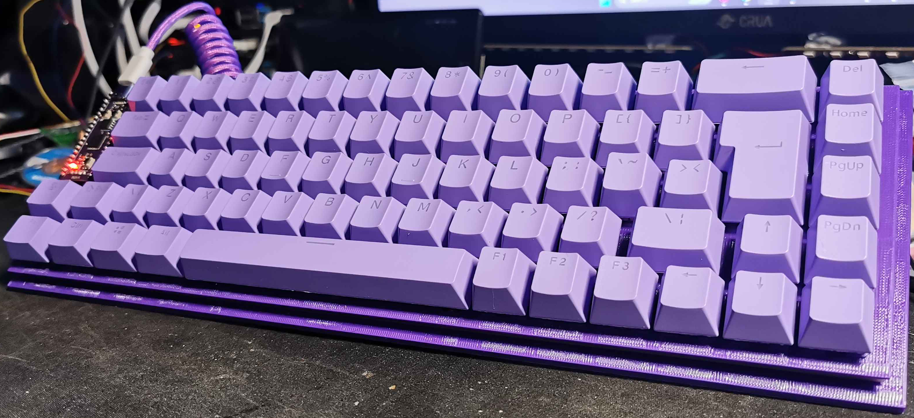

This is my first keyboard i've ever made
I do NOT reccomend you attempt building it
the current QMK firmware is built for the *BODGED* PCB whereas the KiCad files are for a *FIXED* PCB though it shouldnt be too hard of a fix

    

Its a 71 Key QWERTY UK ISO build based off of the Durgod Hades 69 ISO
my build uses AKKO Lavender Purple V3's and a generic keycap set from aliex
The RP2040 is a WEACT rpi 2040 as it is also purple (i think you get the theme here)
I use m2x6mm screws that are threaded into plastic, tho you can also adjust it for heatsets and shorter screws (which i plan on doing if i ever do a rebuild)

AGAIN, I DO NOT RECCOMEND BUILDING THIS
